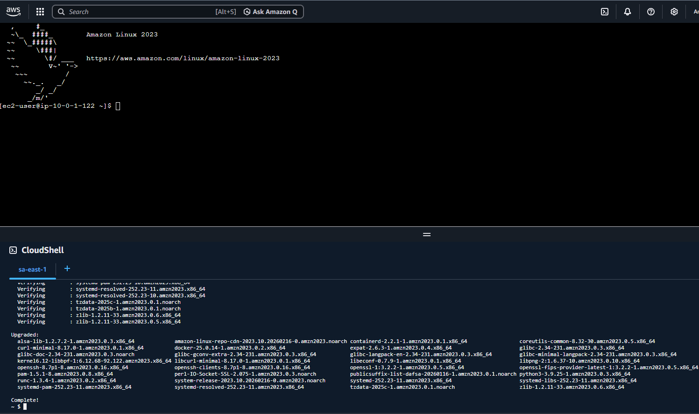
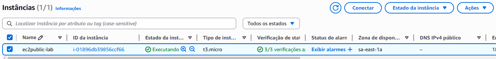
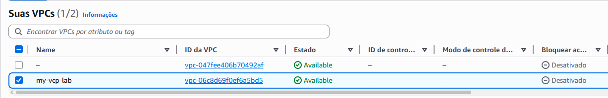

# aws-vcp-ec2-lab
AWS lab: created a custom VPC, public/private subnets, internet gateway, route tables and ec2.

# aws vpc + ec2 lab

this project demonstrates the manually creation of a custom Virtual Private Cloud (VPC) and ec2 using aws.

ARCHITECTURE:

 VPC (10.0.0.0/16)
- Public subnet (10.0.1.0/24)
- Private subnet (10.0.2.0/24)
- Internet gateway
- Route table with internet acess
- EC2 instance (Amazon Linux 2003, t3.micro)

RESULTS:

Successfully launched and connected to an EC2 instance using a public IP address.

SKILLS REQUIRED:

- AWS Cloud fundamentals
- VPC networking
- Subnets: public and private
- Internet Gateway configuration
- EC2 deployment

SCREENSHOTS

